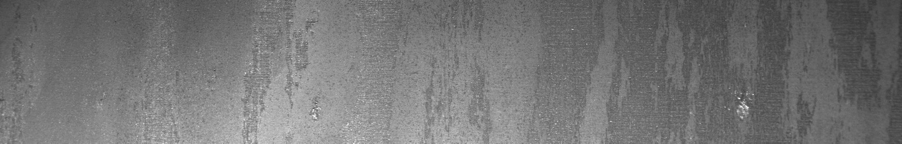

## 钢板缺陷检测
### 1 项目说明


### 2 数据准备
数据集中包含6666张已经标注好的数据，原始数据标注形式为csv格式。该项目采用语义分割的标注方式，在本文档中提供了SEG数据集格式。[点击此处下载数据集]()
更多数据格式信息请参考[数据标注说明文档](https://paddlex.readthedocs.io/zh_CN/release-1.3/data/annotation/index.html)

* **数据切分**
将训练集、验证集和测试集按照7：2：1的比例划分。 PaddleX中提供了简单易用的API，方便用户直接使用进行数据划分。
``` shell
paddlex --split_dataset --format SEG --dataset_dir dataset --val_value 0.2 --test_val 0.1
```

数据文件夹切分前后的状态如下:

```bash
  dataset/                          dataset/
  ├── Annotations/      -->         ├── Annotations/
  ├── JPEGImages/                   ├── JPEGImages/
                                    ├── labels.txt
                                    ├── test_list.txt
                                    ├── train_list.txt
                                    ├── val_list.txt
  ```


### 3 模型选择
PaddleX提供了丰富的视觉模型，在语义分割中提供了DeepLabV3、UNET、HRNET和FastSCNN系列模型。在本项目中采用UNET为分割模型进行钢板缺陷检测。

### 4 模型训练
在项目中，我们采用UNET作为钢板缺陷分割的模型。具体代码请参考[train.py](./train.py)。

运行如下代码开始训练模型：


``` shell
python train.py
```

若输入如下代码，则可在log文件中查看训练日志，log文件保存在`code`目标下
``` shell
python train.py > log
```

### 5 模型优化(进阶)
* 精度提升
  为了进一步提升模型的精度，在项目中采用了一系列模型优化的方式，具体请参考[模型优化文档](./accuracy_improvement.md)
* 速度优化


### 6 模型预测

运行如下代码：
``` bash
python code/infer.py
```
则可生成可视化的分割结果。

预测结果如下：
<div align="center">
image_4e8e7a28c
  
gt_4e8e7a28c
  
predict_4e8e7a28c
  
image_9d34d1ed3
  
gt_9d34d1ed3
  
predict_9d34d1ed3
  
 </div>

使用calc_fps.py脚本可计算预测速度，使用UNET网络推理速度如下。

| arch | resolution  |  FPS |
| --  | -- | -- |
| UNET  | 1600x256  | 26.38 |

 

### 7 模型导出
模型训练后保存在output文件夹，如果要使用PaddleInference进行部署需要导出成静态图的模型,运行如下命令，会自动在output文件夹下创建一个`inference_model`的文件夹，用来存放导出后的模型。

``` bash
paddlex --export_inference --model_dir=output/unet/best_model --save_dir=output/inference_model 
```

### 8 模型上线选择


### 9 模型部署方式
模型部署采用了PaddleX提供的C++ inference部署方案，在改方案中提供了C#部署[Demo](https://github.com/PaddlePaddle/PaddleX/tree/develop/examples/C%23_deploy)，用户可根据实际情况自行参考。


